# foro_hub
Desafío Forohub Alura 2024

# FOROHUB Alura 2024

## 📖 Descripción
Este pequeño proyecto se basa principalmente en la lógica que conlleva un sitio para poder guardar información en una base de datos, extraer información específica de la misma, poder editar esta información y todo ello considerando las medidas de seguridad pertinentes para que, dependiendo el tipo de usuario, se pueda manipular hasta cierto punto la base de datos, abarcando así el control de versiones de las modificaciones a la base de datos para brindarle esta capa de seguridad, incluyendo su implementacion de documentacion de la API. Para más detalles sobre cómo utilizar la API, consulta la documentación completa probando la API. Si tienes preguntas o necesitas soporte, no dudes en contactarme como creador del proyecto.
## 🔨 Funcionalidades
- `Listar topicos`: Devuelve una lista completa de todos los tópicos disponibles en la base de datos.
- `Editar topicos`: Permite a los usuarios editar la información de un tópico existente.
- `Eliminar topicos`: Permite a los usuarios eliminar un tópico específico.
- `Registrar usuarios`: Permite a nuevos usuarios registrarse en la aplicación proporcionando sus detalles básicos.
- `Modificar usuarios`: Permite a los usuarios registrados modificar sus datos de perfil.
- `Autenticar usuarios`:Permite a los usuarios autenticarse proporcionando sus credenciales, devolviendo un token JWT para acceder a las rutas protegidas.
## 🕹️ Uso
Esta es una muestra, a grandes rasgos, del propósito que cumple esta primera versión.

Corremos nuestro programa en IntelliJ:
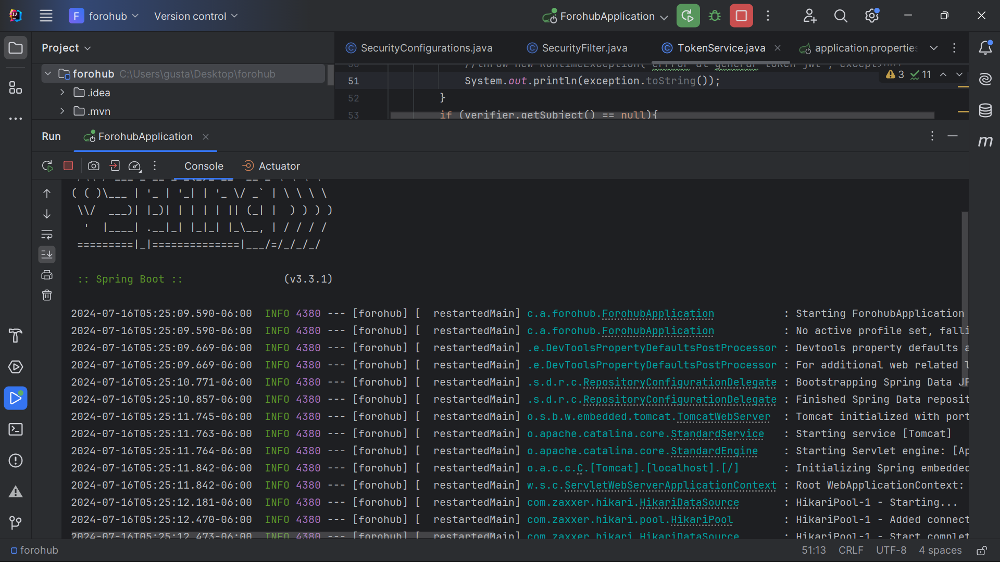

Insomnia servirá como nuestro simulador de un sitio web. Con este vamos a interactuar entre nuestra web hipotética y la base de datos previamente cargada con algunos datos🤟:
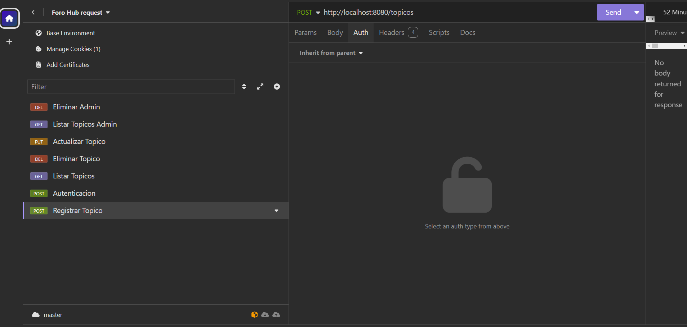

Cualquier funcionalidad que deseemos hacer (Listar, Registrar, Eliminar, Actualizar) con nuestros tópicos, en un inicio estará bloqueda, arrojando un Error 403 Forbidden, el cuál es un error previamente tratado que significa que hay conexión con el servidor pero no así los permisos para interactuar con el contenido:
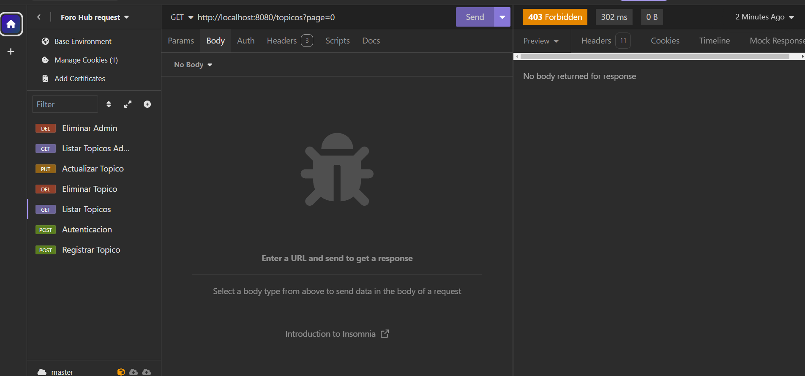
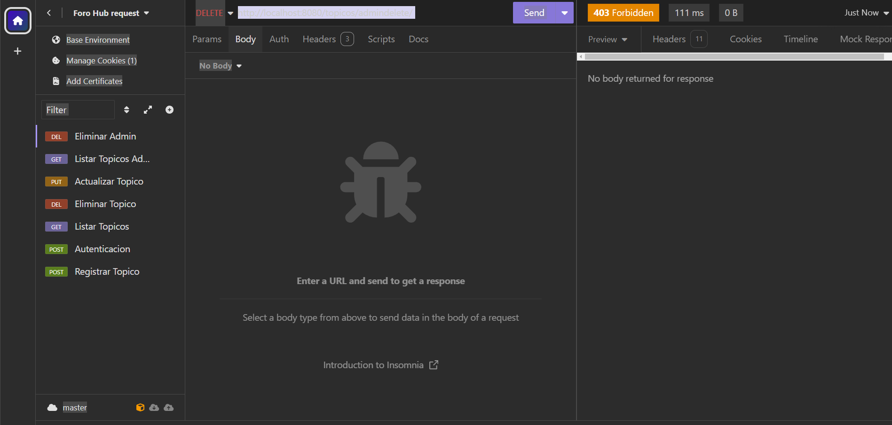

Entonces nos autenticamos. Se entiende que en nuestra base de datos debe haber, precargados, los datos de los usuarios para poder autenticarse. La autenticación nos arroja un Token disponible solo por un tiempo definido🤟:
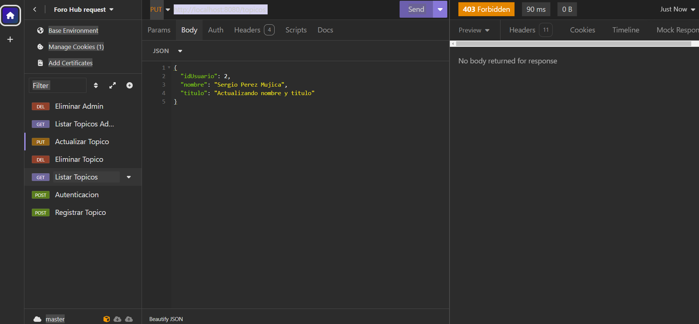
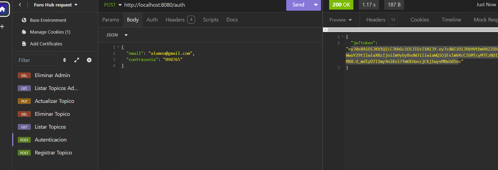

Ingresamos ese Token en la parte Auth de cada funcionalidad que deseemos utilizar:
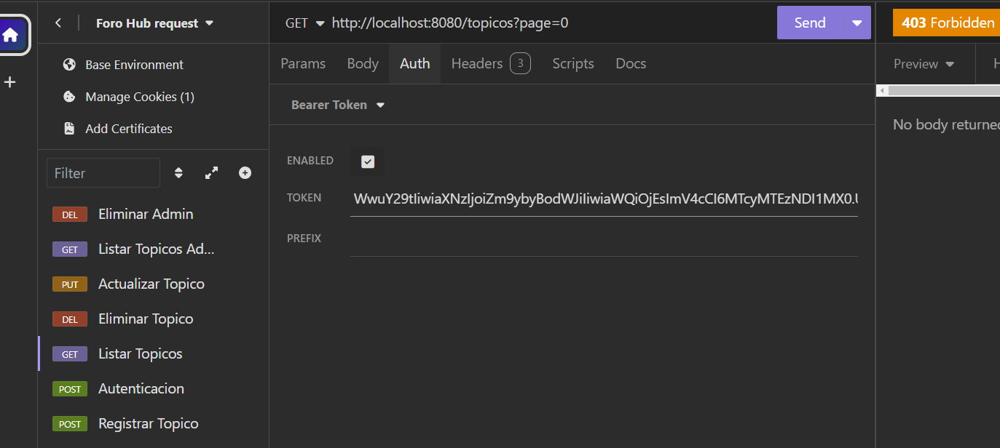

Ahora nos muestra un mensaje 200 con un listado de algunos tópicos que hemos guardado previemante🤟:
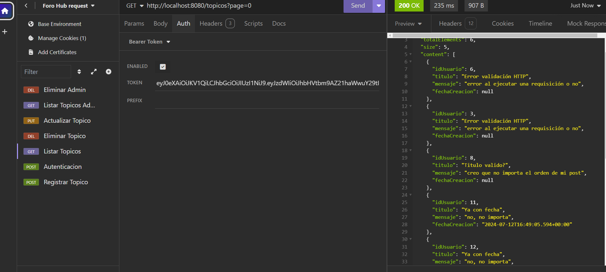

Podemos "eliminar" un tópico, como ejemplo escogemos el 3:
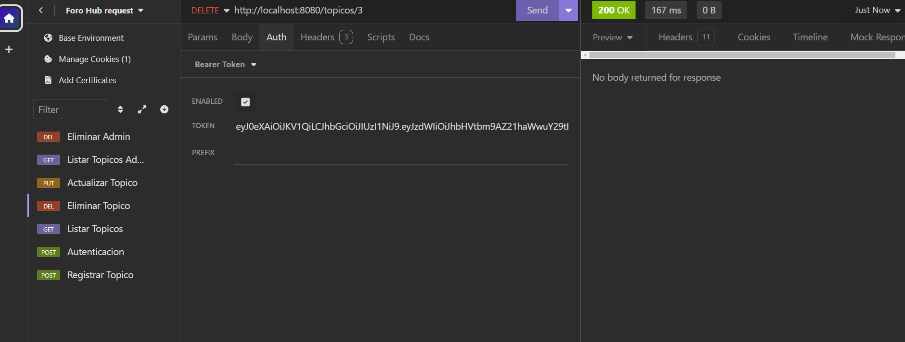

Y volvemos a listar. El tópico ha desaparecido:
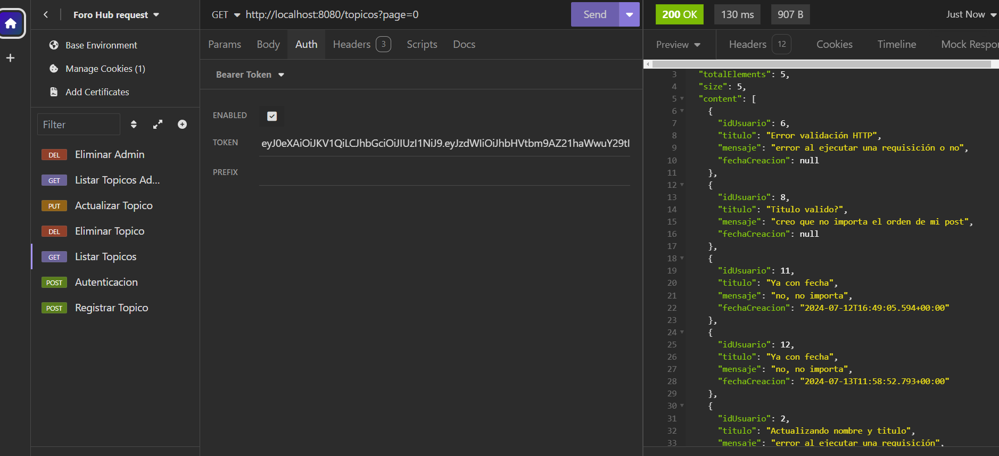

Pero a este usuario no le otorgamos un permiso total, tenemos un funcionalidad para el administrador de la base de datos el cuál puede ver que el tópico recientemente eliminado simplemente se encuentra inactivo🤟:
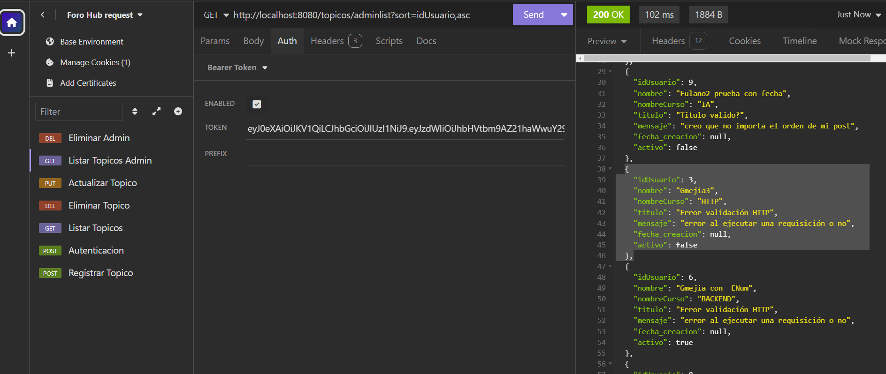

Podemos registrar un nuevo tópico poniendo los datos NombreUsuario, Titulo, Mensaje y NombreCurso:
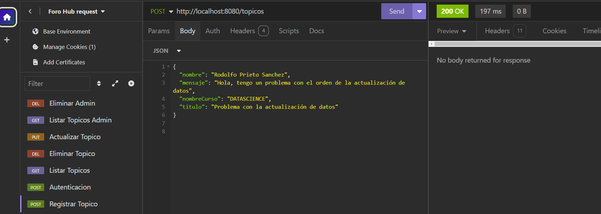

Listamos notando que se genera un Id del tópico y una fecha de creación. En este caso los datos del nombre de usuario y Curso no nos importan🤟:
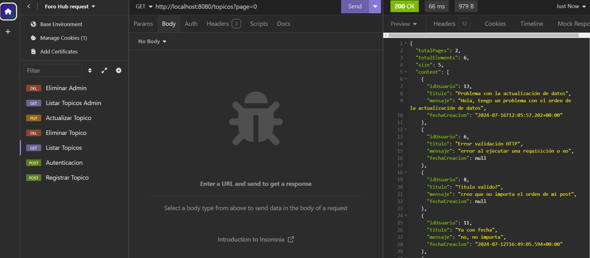

Por último, podemos modificar algún tópico, digamos el 8:
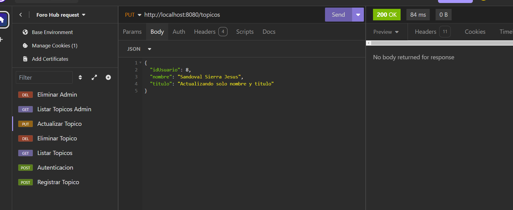

Y listamos 🤟:
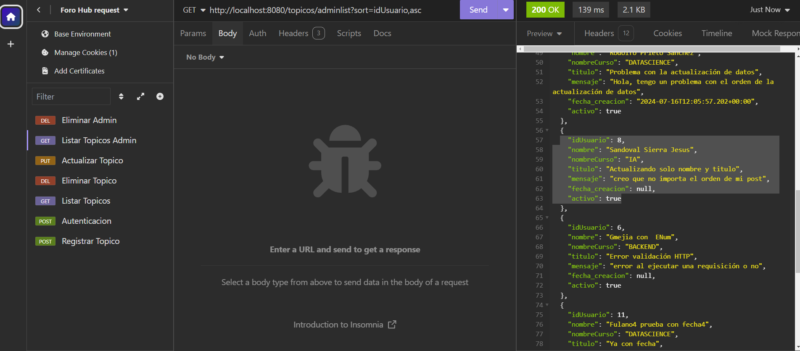

## ✔️ Tecnologias
Hice uso de las siguientes tecnologias para lograr la construccion de este proyecto.
- [Hibernate](https://hibernate.org/) 
- [Postgres](https://www.postgresql.org/)
- [Insomnia](https://insomnia.rest/)
- [SpringBoot](https://spring.io/projects/spring-boot)
- [IntelliJ IDEA](https://www.jetbrains.com/idea/)
- [Spring Initializr](https://start.spring.io/)
- [JWT Token](https://github.com/auth0/java-jwt)
- [Bcrypt Generator](https://bcrypt-generator.com/)

## 👨‍💻 Sobre el Autor
Guz Mexía, mexicano radicado en Francia que busca dar un giro en su carrera profesional aprendiendo sobre tecnología🏰. 

